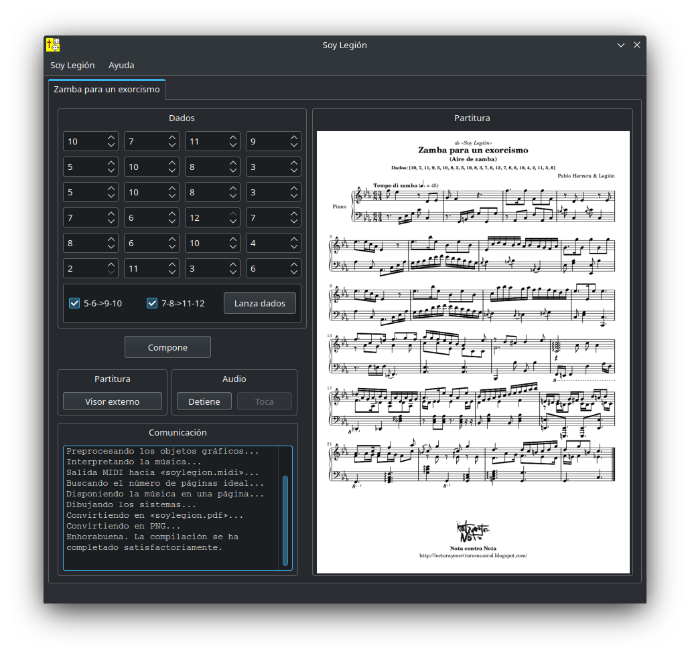

# Soy Legión
*Juego musical de dados, generador de zambas del norte argentino.*

*Soy Legión* es un sistema generador de piezas con aire folclórico del norte argentino, basado en el lanzamiento de dados para definir qué compases deben conformar una pieza producida por este sistema. Cada pieza constará de 24 compases, por lo que se hace necesario lanzar un par de dados esa misma cantidad de veces, anotando en cada ocasión el compás que en suerte haya                  tocado. 

Alternativamente se puede jugar con variantes que acercan desde el punto de vista formal el resultado final más a una zamba que a un aire de zamba. El procedimiento consiste en usar el mismo resultado de dados para los compases 5 y 9, al igual que para los compases 6 y 10. Opcionalmente se puede también practicar el procedimiento para las parejas de compases 7 y 11 y compases 8 y 12.

## Requisitos
- Sistema operativo Windows, Linux o macOS.
- Python 3 instalado.
- pyqt5
- pygame
- LilyPond 2.20 o superior. En sistemas Windows y macOS el directorio de binarios debe estar en el PATH.
